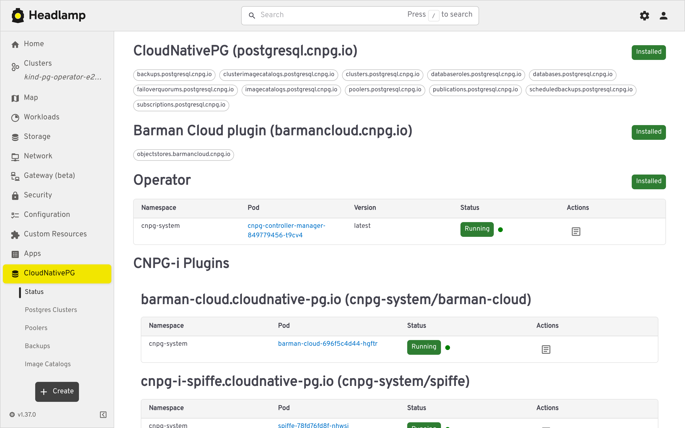
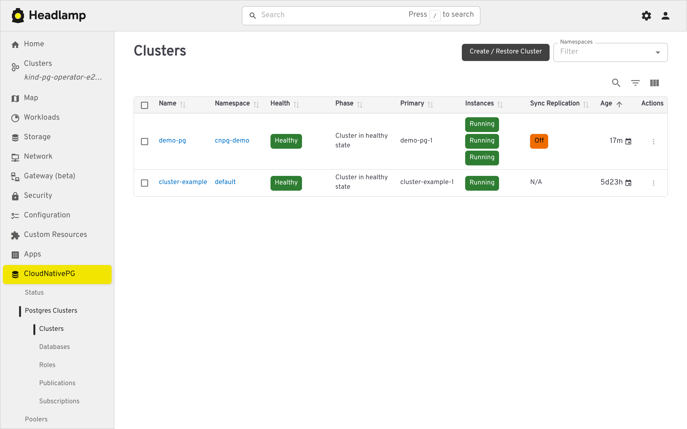
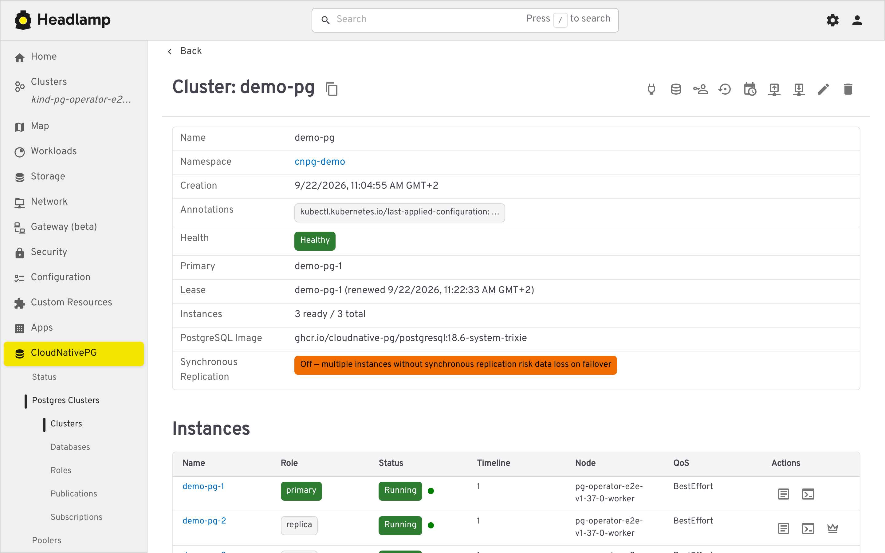
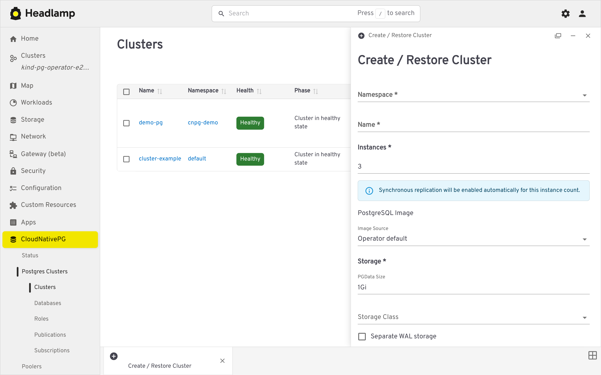
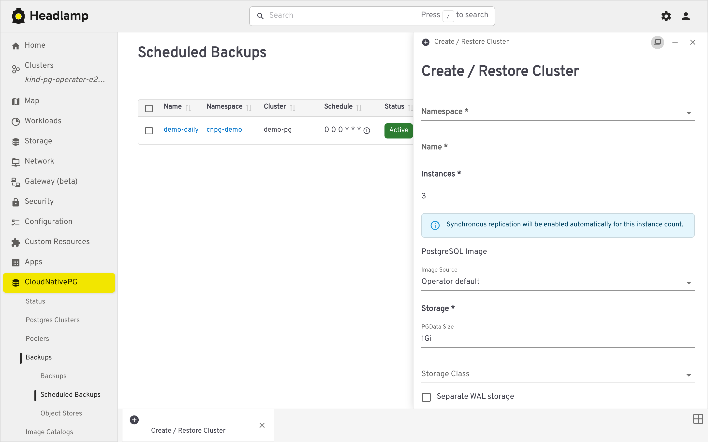
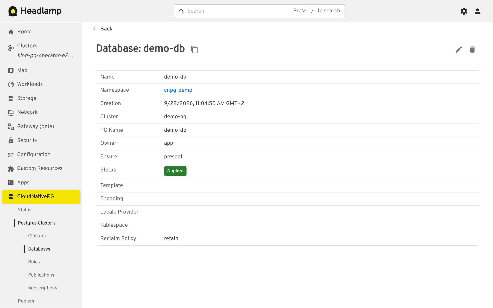
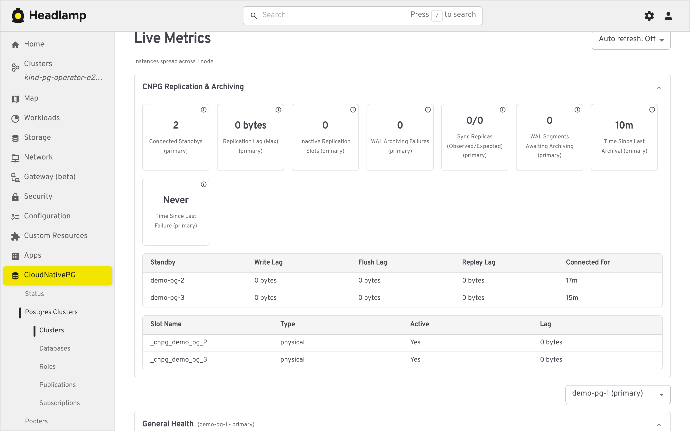

# CNPG Headlamp Plugin

A [Headlamp](https://headlamp.dev/) plugin for managing and visualizing [CloudNativePG](https://cloudnative-pg.io/) (CNPG) resources — Clusters, Poolers, Backups, Scheduled Backups, and Database objects — directly from the Headlamp UI.

## Screenshots

<table>
  <tr>
    <td></td>
    <td></td>
  </tr>
  <tr>
    <td></td>
    <td></td>
  </tr>
  <tr>
    <td></td>
    <td></td>
  </tr>
  <tr>
    <td></td>
  </tr>
 </table>

## Features

#### Clusters

List and detail views, plus a guided creation form.

- Traffic-light health indicator (phase, WAL archiving, last backup)
- Instance roles and synchronous replication warnings
- Per-instance Postgres logs (filterable, color-coded, live-following)
- A `psql` terminal against the primary or any replica
- A **Live Metrics** section on the cluster's detail page, scraped from each instance's CNPG Prometheus exporter (port 9187) via the Kubernetes API's pod proxy subresource, with no `psql` or exec involved. It is organized into collapsible categories: **Replication & Archiving** (primary only: connected standbys, replication lag, inactive slots, WAL archiving failures, backlog and timing, sync replica counts, plus per standby and per slot detail tables), **General Health** and **Checkpointing** (both switchable per instance via a dropdown: connections, cache hit ratio, database size, blocked and long running queries, deadlocks, checkpoint and restartpoint counts), and **Database Health** (transaction ID and multixact age, rollback ratio, temp file spill, and extension updates, per database). A status strip flags fencing, a pending manual switchover, or available extension updates when applicable. Tiles show an (i) icon with a short description and the underlying `cnpg_*` metric name(s), with an optional automatic refresh interval (15s/30s/60s or off, matched to the exporter's own 30 second refresh cadence)
- A manual **switchover** action to promote a chosen replica to primary
- Leader-election **lease** details (holder, acquire/renew time, duration, transitions) alongside the cluster's main info
- Creation form (with live YAML preview) covering instances/HA, storage and tablespaces, backup configuration, volume snapshots, and bootstrap — including bootstrapping a new cluster from an existing backup

#### Poolers (PgBouncer)

List/detail views and a guided creation form.

#### Backups

On-demand backups with status tracking, created against the Barman Cloud plugin or via volume snapshots (not the deprecated in-tree `barmanObjectStore`).

#### Scheduled Backups

- Graphical cron editor (Daily/Weekly/Monthly, plus a raw-text advanced mode) with a humanized schedule description
- A "trigger now" action

#### Object Stores

Manage the `ObjectStore` CRs backing the Barman Cloud plugin, with a "referring clusters" section showing which clusters use each store for backup and/or recovery.

#### Database objects

List/detail/create views for `Database`, `DatabaseRole`, `Publication`, and `Subscription`, each showing reconciliation status.

#### Image Catalogs / Cluster Image Catalogs

List and detail views for managing available Postgres operand images.

#### Operator status page

- Installed CNPG CRDs and operator pod health
- Detected CNPG-i plugins (e.g. Barman Cloud), with quick access to their logs

## Contributing

See [CONTRIBUTING.md](CONTRIBUTING.md) for development setup, the live-load
smoke check, and regenerating screenshots.

## License

Licensed under the [Apache License 2.0](LICENSE).
